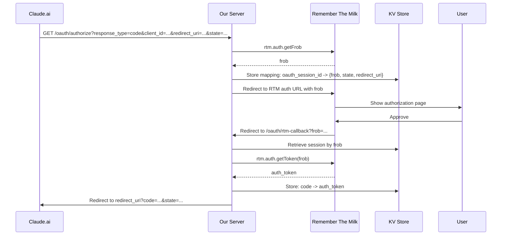

# ADR-010: OAuth2 Adapter for Claude.ai Integration

**Status:** Proposed
**Date:** 2025-06-22

## Context

Claude.ai's "Add Integration" flow expects standard OAuth2 authentication. Our RTM MCP server currently uses Remember The Milk's custom frob-based authentication flow. To enable seamless integration from Claude.ai, we need an adapter that translates between these two authentication protocols.


## Decision

Implement an OAuth2 adapter layer that:
1. Presents standard OAuth2 endpoints to Claude.ai
2. Internally manages RTM's frob-based flow
3. Maintains stateful mappings between OAuth2 codes and RTM tokens

### OAuth2 Endpoints

#### Authorization Endpoint: `/oauth/authorize`
- **Accepts:** Standard OAuth2 parameters
  - `response_type=code`
  - `client_id` (Claude.ai's identifier)
  - `redirect_uri` (Claude.ai callback URL)
  - `state` (CSRF protection)
  - `scope` (optional, defaults to "delete")
- **Returns:** Redirect to RTM authorization

#### Token Endpoint: `/oauth/token`
- **Accepts:** POST with
  - `grant_type=authorization_code`
  - `code` (our generated code)
  - `client_id`
  - `client_secret` (if applicable)
- **Returns:** JSON with `access_token`

### Authorization Flow Translation



### Implementation Details

#### 1. Session Management
```typescript
interface OAuthSession {
  frob: string;
  state: string;
  redirect_uri: string;
  client_id: string;
  created_at: number;
  expires_at: number;
}

interface CodeMapping {
  auth_token: string;
  client_id: string;
  created_at: number;
  expires_at: number;
}
```

#### 2. Authorization Handler (`/oauth/authorize`)
```typescript
app.get("/oauth/authorize", async (c) => {
  const { response_type, client_id, redirect_uri, state, scope } = c.req.query();
  
  // Validate parameters
  if (response_type !== "code") {
    return c.text("unsupported_response_type", 400);
  }
  
  // Get frob from RTM
  const api = new RtmApi(c.env.RTM_API_KEY, c.env.RTM_SHARED_SECRET);
  const frob = await api.getFrob();
  
  // Generate session ID
  const sessionId = crypto.randomUUID();
  
  // Store OAuth session
  const session: OAuthSession = {
    frob,
    state,
    redirect_uri,
    client_id,
    created_at: Date.now(),
    expires_at: Date.now() + 600000 // 10 minutes
  };
  
  await c.env.AUTH_STORE.put(
    `oauth_session:${sessionId}`,
    JSON.stringify(session),
    { expirationTtl: 600 }
  );
  
  // Store frob->session mapping for callback
  await c.env.AUTH_STORE.put(
    `frob_session:${frob}`,
    sessionId,
    { expirationTtl: 600 }
  );
  
  // Build RTM auth URL
  const perms = scope === "read" ? "read" : "delete";
  const authUrl = await api.getAuthUrl(frob, perms);
  
  // Redirect to RTM
  return c.redirect(authUrl);
});
```

#### 3. RTM Callback Handler (`/oauth/rtm-callback`)
```typescript
app.get("/oauth/rtm-callback", async (c) => {
  const frob = c.req.query("frob");
  
  // Retrieve session ID from frob
  const sessionId = await c.env.AUTH_STORE.get(`frob_session:${frob}`);
  if (!sessionId) {
    return c.text("Invalid or expired session", 400);
  }
  
  // Retrieve OAuth session
  const sessionData = await c.env.AUTH_STORE.get(`oauth_session:${sessionId}`);
  const session: OAuthSession = JSON.parse(sessionData);
  
  // Exchange frob for token
  const api = new RtmApi(c.env.RTM_API_KEY, c.env.RTM_SHARED_SECRET);
  const authToken = await api.getToken(frob);
  
  // Generate authorization code
  const code = crypto.randomUUID();
  
  // Store code->token mapping
  const codeMapping: CodeMapping = {
    auth_token: authToken,
    client_id: session.client_id,
    created_at: Date.now(),
    expires_at: Date.now() + 600000 // 10 minutes
  };
  
  await c.env.AUTH_STORE.put(
    `oauth_code:${code}`,
    JSON.stringify(codeMapping),
    { expirationTtl: 600 }
  );
  
  // Clean up session data
  await c.env.AUTH_STORE.delete(`oauth_session:${sessionId}`);
  await c.env.AUTH_STORE.delete(`frob_session:${frob}`);
  
  // Redirect back to Claude.ai
  const redirectUrl = new URL(session.redirect_uri);
  redirectUrl.searchParams.set("code", code);
  redirectUrl.searchParams.set("state", session.state);
  
  return c.redirect(redirectUrl.toString());
});
```

#### 4. Token Exchange Handler (`/oauth/token`)
```typescript
app.post("/oauth/token", async (c) => {
  const body = await c.req.parseBody();
  const { grant_type, code, client_id } = body;
  
  if (grant_type !== "authorization_code") {
    return c.json({ error: "unsupported_grant_type" }, 400);
  }
  
  // Retrieve code mapping
  const codeMappingData = await c.env.AUTH_STORE.get(`oauth_code:${code}`);
  if (!codeMappingData) {
    return c.json({ error: "invalid_grant" }, 400);
  }
  
  const codeMapping: CodeMapping = JSON.parse(codeMappingData);
  
  // Validate client_id
  if (codeMapping.client_id !== client_id) {
    return c.json({ error: "invalid_client" }, 400);
  }
  
  // Store permanent token mapping
  await c.env.AUTH_STORE.put(
    `token:${codeMapping.auth_token}`,
    "active"
  );
  
  // Clean up code
  await c.env.AUTH_STORE.delete(`oauth_code:${code}`);
  
  // Return OAuth2 token response
  return c.json({
    access_token: codeMapping.auth_token,
    token_type: "Bearer",
    scope: "delete"
  });
});
```

### Security Considerations

1. **State Parameter:** Used for CSRF protection, passed through entire flow
2. **Time-Limited Sessions:** All temporary data expires after 10 minutes
3. **Client Validation:** Ensure client_id matches throughout flow
4. **Secure Token Storage:** Leverage existing KV patterns from manual flow

### Using Existing Utilities

From `workers-oauth-utils.ts`:
- Use `_encodeState`/`decodeState` for secure state parameter handling
- Leverage cookie signing functions if client approval persistence needed
- Adapt approval dialog rendering for future client consent flows

## Consequences

### Positive
- Seamless Claude.ai integration via standard OAuth2
- No manual token copying required
- Maintains per-user authentication model
- Reuses existing RTM API client and KV patterns

### Negative
- Additional complexity with dual authentication flows
- More KV storage operations for session management
- Potential confusion with two authentication paths

## Implementation Notes

1. Start with core OAuth2 endpoints
2. Add comprehensive error handling per OAuth2 spec
3. Consider rate limiting on authorization endpoint
4. Add monitoring for failed auth attempts
5. Document the integration URL pattern for Claude.ai users